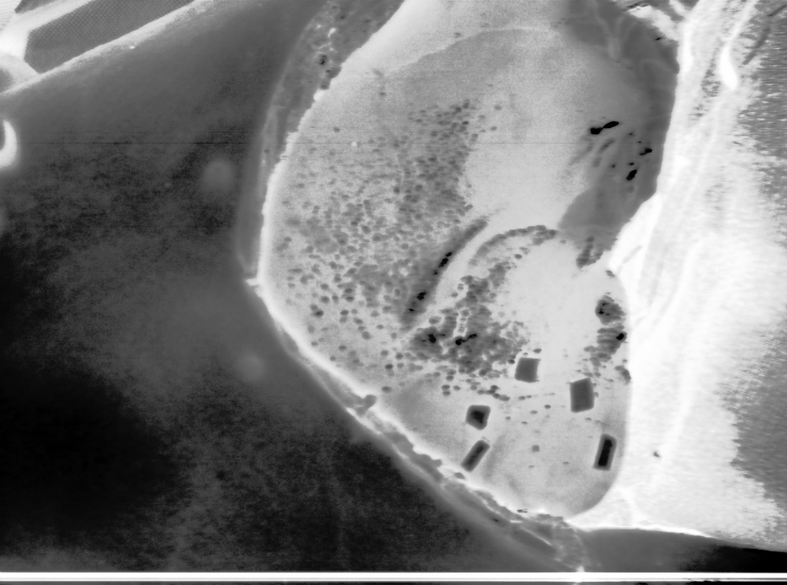
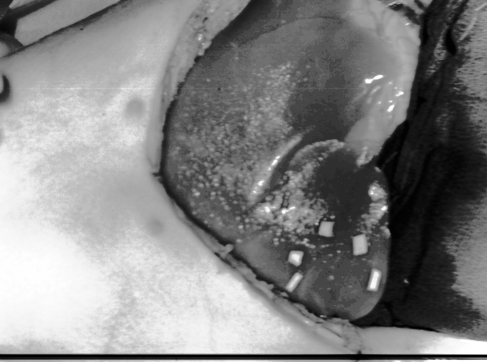
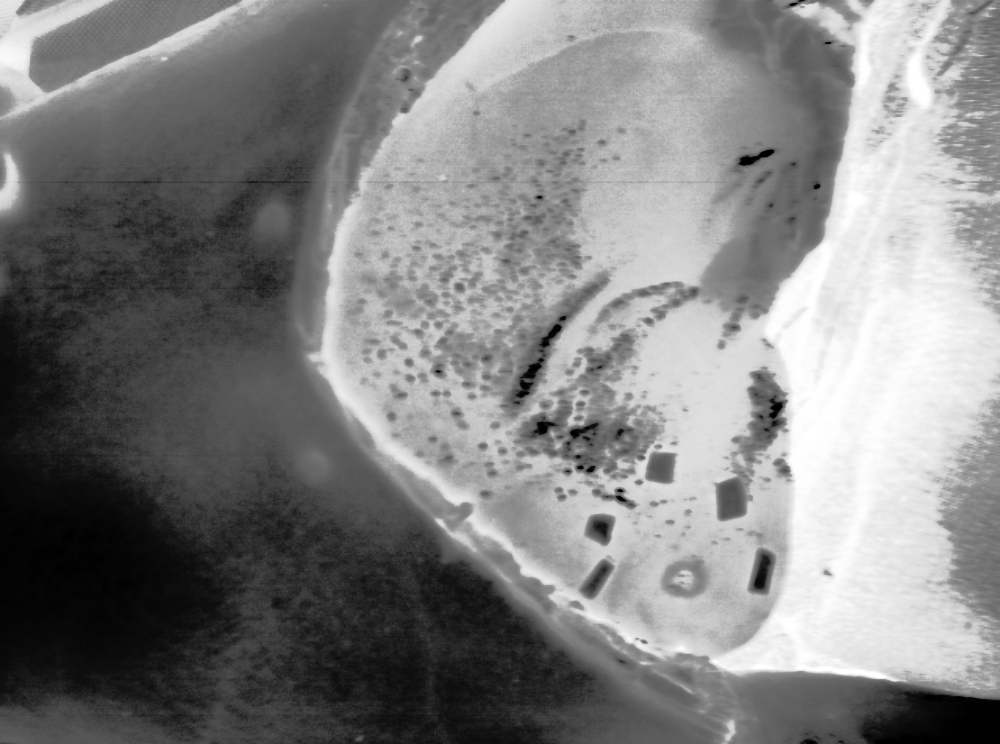
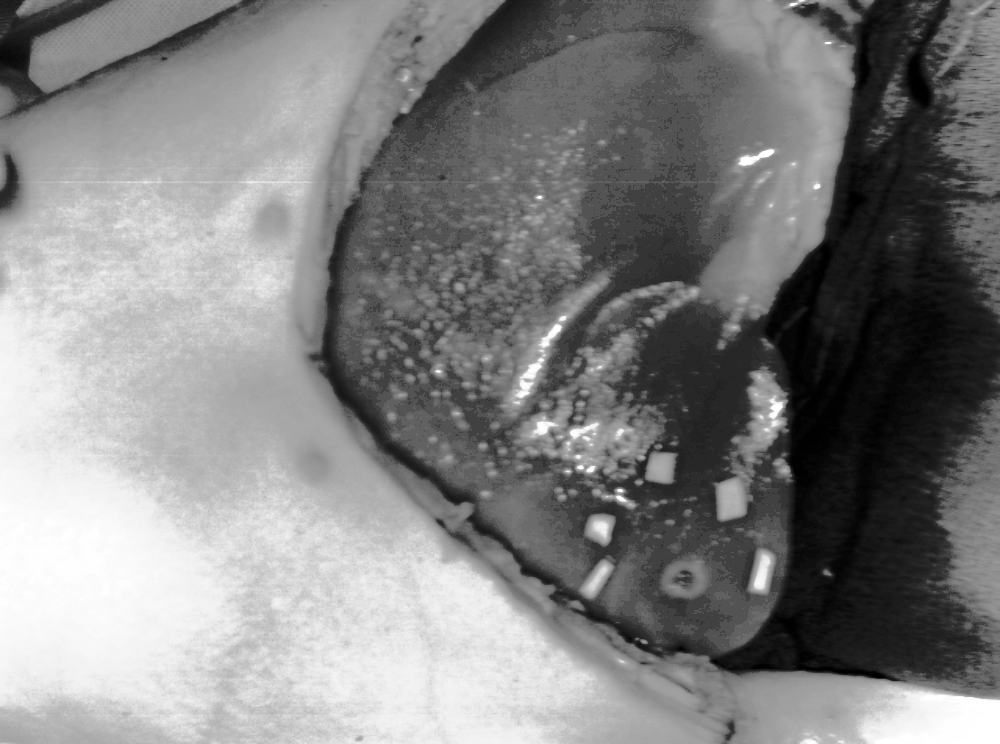
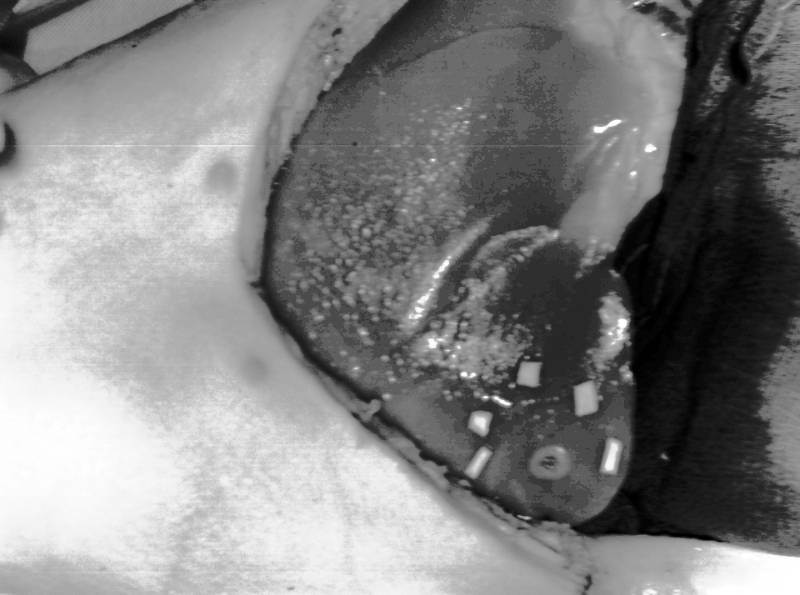

# Segmentation and analysis of hyperspectral images
This repository is dedicated to the segmentation of [hyperspectral images](https://en.wikipedia.org/wiki/Hyperspectral_imaging) during experimental animal surgery.

## Requirements

- Linux or macOS (Windows has not been officially tested)
- Python 3.8.x

## Installation

Step 1: Download and install Miniconda
``` bash
wget https://repo.anaconda.com/miniconda/Miniconda3-py38_22.11.1-1-Linux-x86_64.sh
chmod +x Miniconda3-latest-Linux-x86_64.sh
./Miniconda3-latest-Linux-x86_64.sh
```

Step 2: Install FFmpeg and verify that the installation is correct

- Linux
``` bash
sudo apt update
sudo apt upgrade
sudo apt install ffmpeg
ffmpeg -version
```

- macOS
``` bash
brew update
brew upgrade
brew install ffmpeg
ffmpeg
```

Step 3: Clone the repository, create a conda environment, and install the requirements for the repository
``` bash
git clone https://github.com/ViacheslavDanilov/oct_segmentation.git
cd oct_segmentation
chmod +x create_env.sh
source create_env.sh
```

Step 4: Initialize git hooks using the pre-commit framework
``` bash
pre-commit install
```

## Data

In order to download the data do the following:

1. Clone the repository
``` bash
git clone https://github.com/ViacheslavDanilov/hsi_analysis.git
```

2. Install DVC
``` bash
pip install dvc[gdrive]==2.41.1
```

3. Download dataset using DVC

|       Dataset        |                                                                                       Description                                                                                        | Size, Gb |                Command                 |
|:--------------------:|:----------------------------------------------------------------------------------------------------------------------------------------------------------------------------------------:|:--------:|:--------------------------------------:|
|         Raw          |                                                                        Dataset inclduing 304 hyperspectral images                                                                        |   34.4   |    ```dvc pull dvc/data/raw.dvc```     |
| Supervisely (input)  |                                                    Dataset used for labeling on the [Sueprvsiely](https://supervisely.com/) platform                                                     |   7.5    | ```dvc pull dvc/data/sly_input.dvc```  |
| Supervisely (output) | Dataset that represents the labeled dataset for object detection in a [Supervisely format](https://docs.supervise.ly/data-organization/00_ann_format_navi/04_supervisely_format_objects) |   2.6    | ```dvc pull dvc/data/sly_output.dvc``` |
|       Interim        |                                                                 Dataset used for debugging and explanatory data analysis                                                                 |   2.6    |  ```dvc pull dvc/data/interim.dvc```   |
|         COCO         |                                        Dataset in [COCO format](https://cocodataset.org/#format-data) and used to train object recognition models                                        |   10.5   |    ```dvc pull dvc/data/coco.dvc```    |


<table style="width:100%">
    <caption>
        Table 1. Example of hyperspectral images taken at different temperatures
    </caption>
    <tr>
        <th valign="middle" align="center">Stage </th>
        <th valign="middle" align="center">Absorbance</th>
        <th valign="middle" align="center">HSV</th>
        <th valign="middle" align="center">Reflectance</th>
    </tr>
    <tr>
        <td valign="middle" align="center">Start</td>
        <td valign="middle" align="center"></td>
        <td valign="middle" align="center"></td>
        <td valign="middle" align="center"></td>
    </tr>
    <tr>
        <td valign="middle" align="center">Middle</td>
        <td valign="middle" align="center"></td>
        <td valign="middle" align="center"></td>
        <td valign="middle" align="center"></td>
    </tr>
    <tr>
        <td valign="middle" align="center">End</td>
        <td valign="middle" align="center"></td>
        <td valign="middle" align="center"></td>
        <td valign="middle" align="center"></td>
    </tr>
</table>
