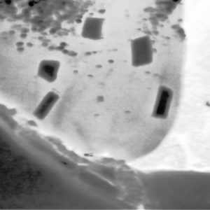
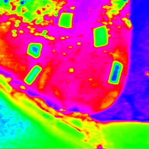
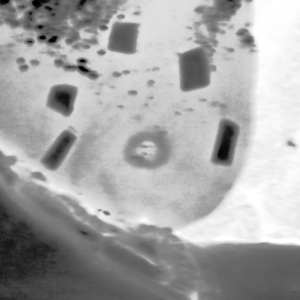
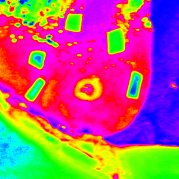
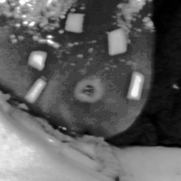
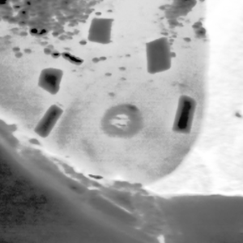
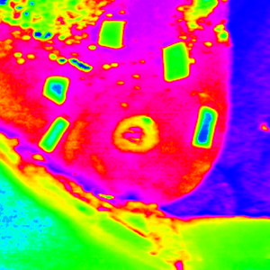
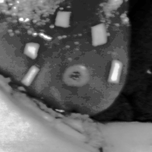

[](https://doi.org/10.5281/zenodo.10444212)
[](https://doi.org/10.5281/zenodo.10444269)

# Harnessing Machine Learning for Laser Ablation Assessment in Hyperspectral Imaging
This repository is dedicated to the segmentation of [hyperspectral images](https://en.wikipedia.org/wiki/Hyperspectral_imaging) during experimental animal surgery, where a variety of tasks were performed to process and analyze the hyperspectral data collected at the [Institute of Image Guided Surgery](https://www.ihu-strasbourg.eu/en/) in Strasbourg.

## 💻 Requirements

- Operating System
  - [x] macOS
  - [x] Linux
  - [x] Windows (limited testing carried out)
- Python 3.8.x
- Required core packages: [dev.txt](https://github.com/ViacheslavDanilov/hsi_analysis/blob/main/requirements/dev.txt)

## Installation

Step 1: Download and install Miniconda
``` bash
wget https://repo.anaconda.com/miniconda/Miniconda3-py38_22.11.1-1-Linux-x86_64.sh
chmod +x Miniconda3-latest-Linux-x86_64.sh
./Miniconda3-latest-Linux-x86_64.sh
```

Step 2: Install FFmpeg and verify that the installation is correct

- Linux
``` bash
sudo apt update
sudo apt upgrade
sudo apt install ffmpeg
ffmpeg -version
```

- macOS
``` bash
brew update
brew upgrade
brew install ffmpeg
ffmpeg
```

Step 3: Clone the repository, create a conda environment, and install the requirements for the repository
``` bash
git clone https://github.com/ViacheslavDanilov/oct_segmentation.git
cd oct_segmentation
chmod +x create_env.sh
source create_env.sh
```

Step 4: Initialize git hooks using the pre-commit framework
``` bash
pre-commit install
```

## Data


<p align="right">Table 1. Example of hyperspectral images taken at different wavelengths</p>

|                                                     Absorbance                                                      |                                                         HSV                                                         |                                                     Reflectance                                                     |
|:-------------------------------------------------------------------------------------------------------------------:|:-------------------------------------------------------------------------------------------------------------------:|:-------------------------------------------------------------------------------------------------------------------:|
| <video src="https://user-images.githubusercontent.com/32963687/231411783-c27c9b29-bfc0-4795-a804-a4b4ee17e15f.mp4"> | <video src="https://user-images.githubusercontent.com/32963687/231411858-5f4a7f82-6137-451e-8ed0-1d285618408f.mp4"> | <video src="https://user-images.githubusercontent.com/32963687/231411922-3bf00316-76c9-40da-99fc-c27227acbfec.mp4"> |

&nbsp;
<table style="width:100%">
        <p align="right">Table 2. Ablated area at different temperatures<p>
    <tr>
        <th valign="middle" align="center">T </th>
        <th valign="middle" align="center">Absorbance</th>
        <th valign="middle" align="center">HSV</th>
        <th valign="middle" align="center">Reflectance</th>
    </tr>
    <tr>
        <td valign="middle" align="center">35</td>
        <td valign="middle" align="center"></td>
        <td valign="middle" align="center"></td>
        <td valign="middle" align="center"></td>
    </tr>
    <tr>
        <td valign="middle" align="center">60</td>
        <td valign="middle" align="center"></td>
        <td valign="middle" align="center"></td>
        <td valign="middle" align="center"></td>
    </tr>
    <tr>
        <td valign="middle" align="center">110</td>
        <td valign="middle" align="center"></td>
        <td valign="middle" align="center"></td>
        <td valign="middle" align="center"></td>
    </tr>
</table>


## Data Access

All essential components of the study, including the curated dataset and trained models, have been made publicly available:
- Dataset: https://zenodo.org/doi/10.5281/zenodo.10444212.
- Models: https://zenodo.org/doi/10.5281/zenodo.10444269.

Alternatively, you may download the dataset, models, and study results using the DVC commands listed below.

**NOTE:** As the data storage is organized through Google Drive, errors may occur when downloading study artifacts due to insufficient permissions to the data repository. If you encounter problems with the dataset or models, or if you would like to use the data presented, please contact [Viacheslav Danilov](https://github.com/ViacheslavDanilov) at <a href="mailto:viacheslav.v.danilov@gmail.com">viacheslav.v.danilov@gmail.com</a> or [Paola Saccomandi](https://mecc.polimi.it/en/research/faculty/prof-paola-saccomandi) at <a href="mailto:paola.saccomandi@polimi.it">paola.saccomandi@polimi.it</a> to request access to the data repository. Please note that access is only granted upon request.

1. To download the data, clone the repository:
``` bash
git clone https://github.com/ViacheslavDanilov/hsi_analysis.git
```

2. Install DVC:
``` bash
pip install dvc==2.55.0 dvc-gdrive==2.19.2
```

3. Download the dataset(s) using the following DVC commands:

|                                                   Dataset                                                   |                                                                                       Description                                                                                        | Size, Gb |                Command                 |
|:-----------------------------------------------------------------------------------------------------------:|:----------------------------------------------------------------------------------------------------------------------------------------------------------------------------------------:|:--------:|:--------------------------------------:|
|             [Raw](https://github.com/ViacheslavDanilov/hsi_analysis/blob/main/dvc/data/raw.dvc)             |                                                              Dataset based on 26 experiments with 304 hyperspectral images                                                               |   34.4   |    ```dvc pull dvc/data/raw.dvc```     |
|  [Supervisely (input)](https://github.com/ViacheslavDanilov/hsi_analysis/blob/main/dvc/data/sly_input.dvc)  |                                                    Dataset used for labeling on the [Sueprvsiely](https://supervisely.com/) platform                                                     |   7.5    | ```dvc pull dvc/data/sly_input.dvc```  |
| [Supervisely (output)](https://github.com/ViacheslavDanilov/hsi_analysis/blob/main/dvc/data/sly_output.dvc) | Dataset that represents the labeled dataset for object detection in a [Supervisely format](https://docs.supervise.ly/data-organization/00_ann_format_navi/04_supervisely_format_objects) |   2.6    | ```dvc pull dvc/data/sly_output.dvc``` |
|         [Interim](https://github.com/ViacheslavDanilov/hsi_analysis/blob/main/dvc/data/interim.dvc)         |                                                                 Dataset used for debugging and explanatory data analysis                                                                 |   2.6    |  ```dvc pull dvc/data/interim.dvc```   |
|            [COCO](https://github.com/ViacheslavDanilov/hsi_analysis/blob/main/dvc/data/coco.dvc)            |                                        Dataset in [COCO format](https://cocodataset.org/#format-data) and used to train object recognition models                                        |   10.5   |    ```dvc pull dvc/data/coco.dvc```    |

4. Download the study results using the following DVC commands:

|                                                           Artifact                                                           |                                Description                                 | Size, Gb |                      Command                      |
|:----------------------------------------------------------------------------------------------------------------------------:|:--------------------------------------------------------------------------:|:--------:|:-------------------------------------------------:|
|        [Object detection results](https://github.com/ViacheslavDanilov/hsi_analysis/blob/main/dvc/models/mlruns.dvc)         | Results of training four different Faster R-CNN networks tracked by MLFlow |   0.67   |       ```dvc pull dvc/models/mlruns.dvc```        |
|       [Clustering results](https://github.com/ViacheslavDanilov/hsi_analysis/blob/main/dvc/clustering/mean_shift.dvc)        |    Segmentation of hyperspectral images using the Mean Shift algorithm     |   19.6   |   ```dvc pull dvc/clustering/mean_shift.dvc```    |
|  [Faster R-CNN (PCA + Abs)](https://github.com/ViacheslavDanilov/hsi_analysis/blob/main/dvc/models/FasterRCNN_pca_abs.dvc)   |         Faster R-CNN model trained on the PCA + Absorbance dataset         |   0.33   |    ```dvc dvc/models/FasterRCNN_pca_abs.dvc```    |
|  [Faster R-CNN (PCA + Ref)](https://github.com/ViacheslavDanilov/hsi_analysis/blob/main/dvc/models/FasterRCNN_pca_ref.dvc)   |        Faster R-CNN model trained on the PCA + Reflectance dataset         |   0.33   | ```dvc pull dvc/models/FasterRCNN_pca_ref.dvc```  |
| [Faster R-CNN (t-SNE + Abs)](https://github.com/ViacheslavDanilov/hsi_analysis/blob/main/dvc/models/FasterRCNN_tsne_abs.dvc) |        Faster R-CNN model trained on the t-SNE + Absorbance dataset        |   0.33   | ```dvc pull dvc/models/FasterRCNN_tsne_abs.dvc``` |
| [Faster R-CNN (t-SNE + Ref)](https://github.com/ViacheslavDanilov/hsi_analysis/blob/main/dvc/models/FasterRCNN_tsne_ref.dvc) |       Faster R-CNN model trained on the t-SNE + Reflectance dataset        |   0.33   | ```dvc pull dvc/models/FasterRCNN_tsne_ref.dvc``` |
