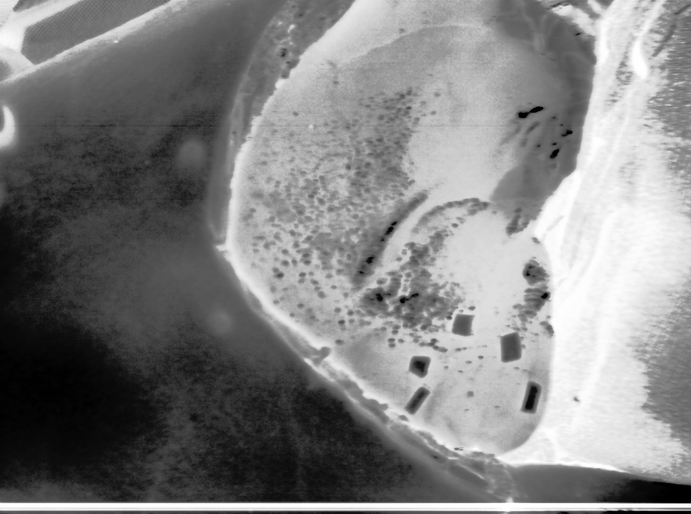
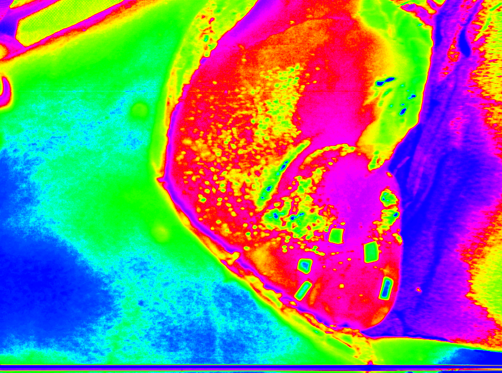
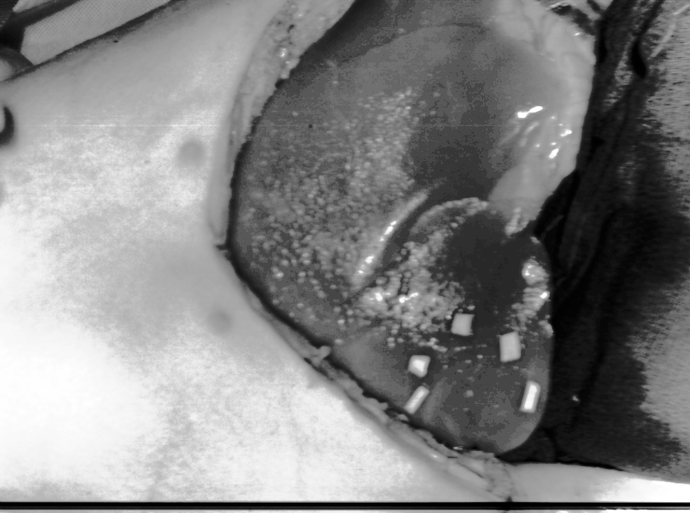
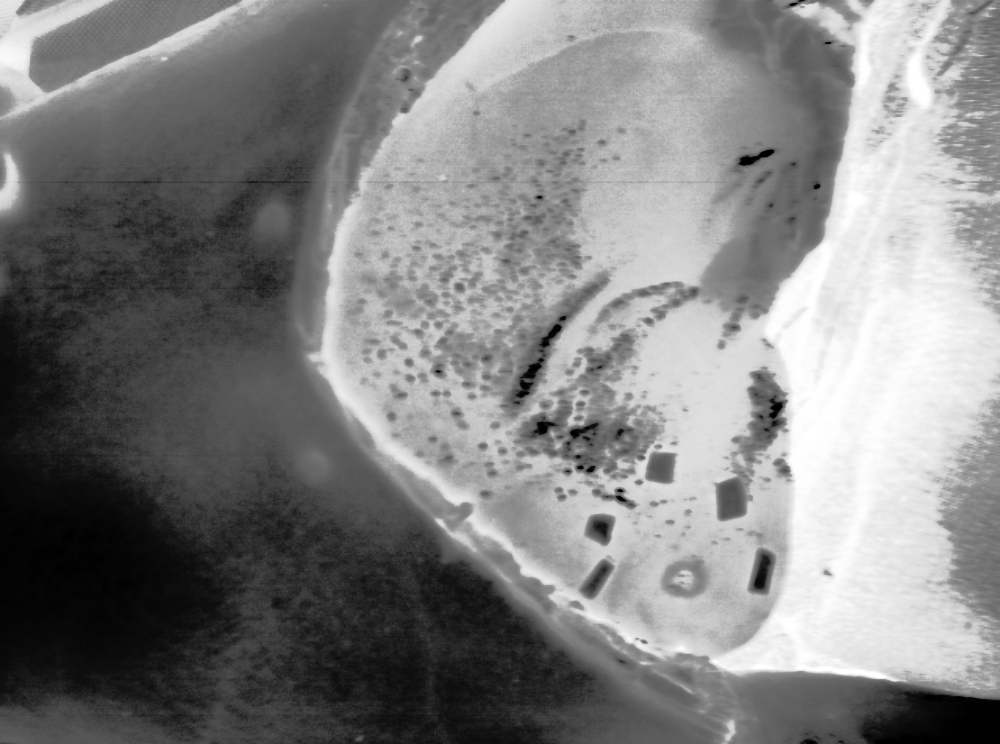
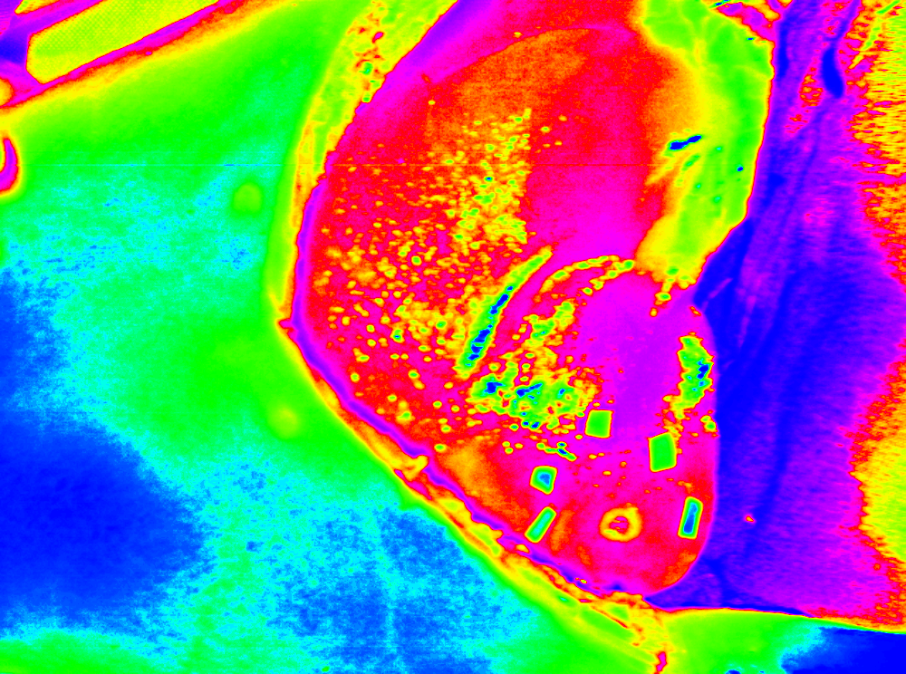
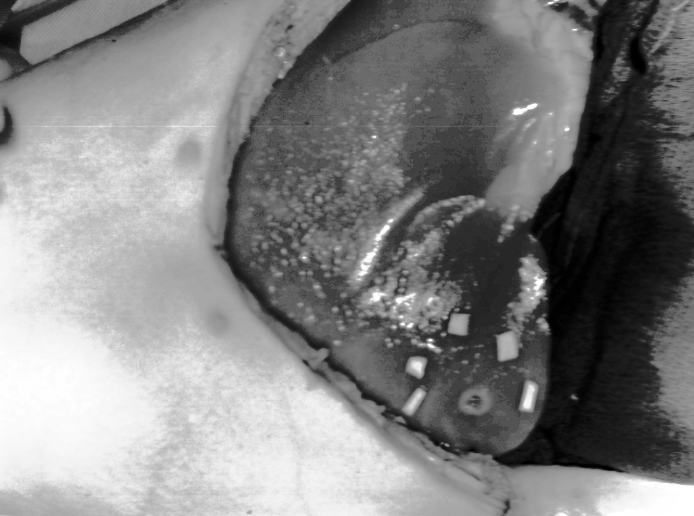
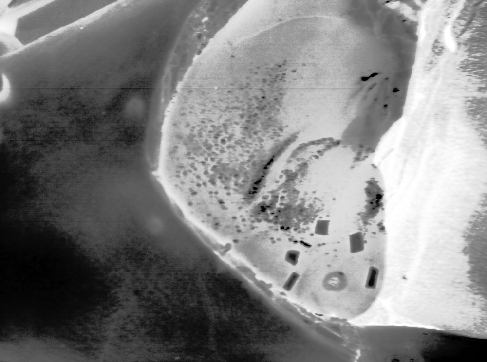
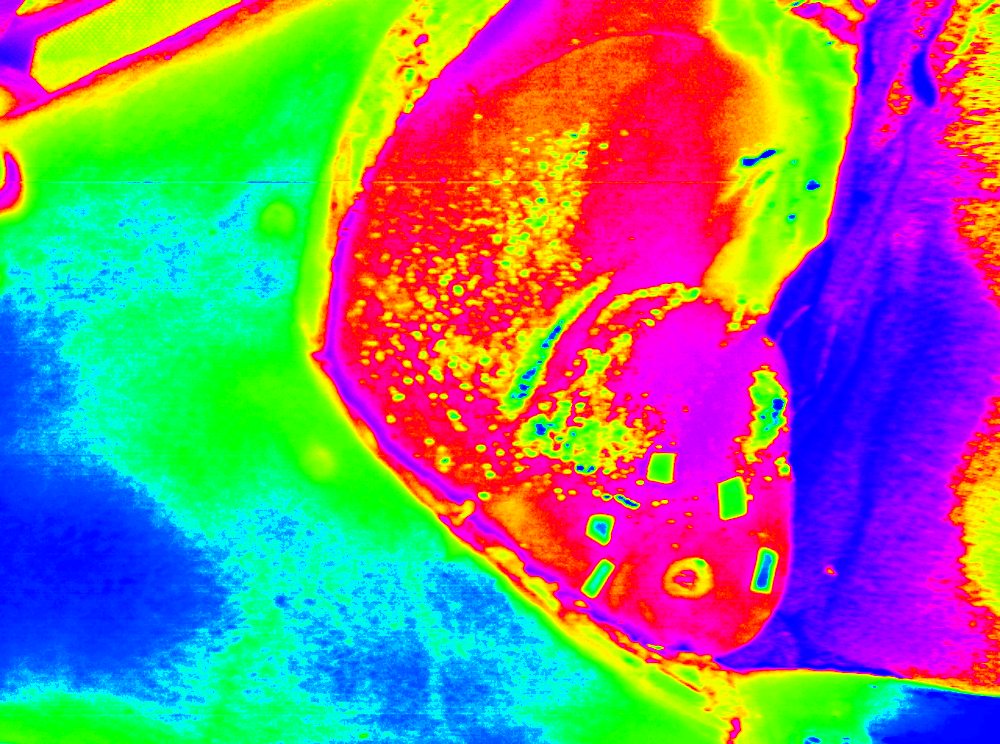
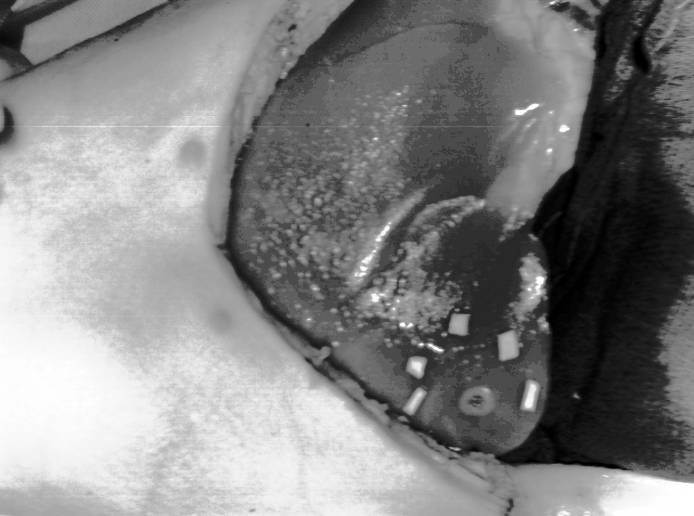

# Segmentation and analysis of hyperspectral images

<table style="width:100%">
    <caption>
        Table 1. Example of hyperspectral images taken at different temperatures
    </caption>
    <tr>
        <th valign="middle" align="center">Stage </th>
        <th valign="middle" align="center">Absorbance</th>
        <th valign="middle" align="center">HSV</th>
        <th valign="middle" align="center">Reflectance</th>
    </tr>
    <tr>
        <td valign="middle" align="center">Start</td>
        <td valign="middle" align="center"></td>
        <td valign="middle" align="center"></td>
        <td valign="middle" align="center"></td>
    </tr> 
    <tr>
        <td valign="middle" align="center">Middle</td>
        <td valign="middle" align="center"></td>
        <td valign="middle" align="center"></td>
        <td valign="middle" align="center"></td>
    </tr>
    <tr>
        <td valign="middle" align="center">End</td>
        <td valign="middle" align="center"></td>
        <td valign="middle" align="center"></td>
        <td valign="middle" align="center"></td>
    </tr>
</table>