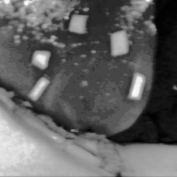

[](https://zenodo.org/doi/10.5281/zenodo.10444212)
[](https://zenodo.org/doi/10.5281/zenodo.10444269)
[](https://www.sciencedirect.com/journal/computers-in-biology-and-medicine)

# Harnessing machine learning for laser ablation assessment in hyperspectral imaging

<a name="contents"></a>
## 📖 Contents
- [Introduction](#introduction)
- [Data](#data)
- [Methods](#methods)
- [Results](#results)
- [Conclusion](#conclusion)
- [Requirements](#requirements)
- [Installation](#installation)
- [Data Access](#data-access)
- [How to Cite](#how-to-cite)

<a name="introduction"></a>
## 🎯 Introduction
Our study aims to advance the application of dimensionality reduction, object detection, and segmentation in Hyperspectral Imaging (HSI), specifically for tissue ablation monitoring. We evaluate different modalities for ablation detection and segmentation in [hyperspectral images](https://en.wikipedia.org/wiki/Hyperspectral_imaging), focusing on thermal effects induced by laser ablation treatment _in vivo_.

<a name="data"></a>
## 📂 Data

During our experimental study, we utilized a [TIVITA hyperspectral camera](https://diaspective-vision.com/en/produkt/tivita-2-0/#produkt) with a spectral range of 500-995 nm to capture hypercubes of 640x480x100 voxels, encompassing 100 bands, alongside regular RGB images. The acquisition process, synchronized to mitigate breathing motion, involved placing polyurethane markers around the target area for spatial reference. To minimize extraneous light, the camera was positioned vertically at a 40 cm distance from the surgical field. A 20 W Halogen lamp was used as the light source. Two distinct imaging modes, reflectance-based and absorbance-based (<a href="#table-1">Table 1</a> and <a href="#table-2">Table 2</a>), were employed to provide comprehensive insight into sample properties. A dataset comprising 233 hyperspectral cubes from 20 experiments, spanning pre-laparotomy, temperature escalation, and post-ablation phases, was collected, offering a robust foundation for analysis. Temperature thresholds recorded during the experiments delineate the thermal effects produced, as illustrated in accompanying figures.

<p align="right"><i><strong id="table-1">Table 1.</strong> Example of hyperspectral images taken at different wavelengths.</i></p>

|                                                     Absorbance                                                      |                                                         HSV                                                         |                                                     Reflectance                                                     |
|:-------------------------------------------------------------------------------------------------------------------:|:-------------------------------------------------------------------------------------------------------------------:|:-------------------------------------------------------------------------------------------------------------------:|
| <video src="https://user-images.githubusercontent.com/32963687/231411783-c27c9b29-bfc0-4795-a804-a4b4ee17e15f.mp4"> | <video src="https://user-images.githubusercontent.com/32963687/231411858-5f4a7f82-6137-451e-8ed0-1d285618408f.mp4"> | <video src="https://user-images.githubusercontent.com/32963687/231411922-3bf00316-76c9-40da-99fc-c27227acbfec.mp4"> |

&nbsp;
<table style="width:100%">
        <p align="right"><i><strong id="table-2">Table 2.</strong> Ablated area at different temperatures.</i><p>
    <tr>
        <th valign="middle" align="center">T </th>
        <th valign="middle" align="center">Absorbance</th>
        <th valign="middle" align="center">HSV</th>
        <th valign="middle" align="center">Reflectance</th>
    </tr>
    <tr>
        <td valign="middle" align="center">35</td>
        <td valign="middle" align="center"></td>
        <td valign="middle" align="center"></td>
        <td valign="middle" align="center"></td>
    </tr>
    <tr>
        <td valign="middle" align="center">60</td>
        <td valign="middle" align="center"></td>
        <td valign="middle" align="center"></td>
        <td valign="middle" align="center"></td>
    </tr>
    <tr>
        <td valign="middle" align="center">110</td>
        <td valign="middle" align="center"></td>
        <td valign="middle" align="center"></td>
        <td valign="middle" align="center"></td>
    </tr>
</table>

<a name="methods"></a>
## 🔬 Methods
The workflow proposed in this study, presented in <a href="#figure-1">Figure 1</a>, consists of several key steps to extract valuable information from hyperspectral data in the laser-mediated thermal treatment scenario. First, dimensionality reduction is applied to reduce the high-dimensional data to a manageable size. Next, a supervised learning technique based on neural networks is used to detect the ablation area, i.e., the region of the image where tissue has been treated by laser irradiation. Finally, an unsupervised learning technique based on clustering is used to segment the spectral signature of the ablation area, allowing the identification of specific tissue types or classes of thermal damage. The proposed workflow provides a comprehensive approach to the analysis of hyperspectral data and has the potential to improve the accuracy and efficiency of diseased tissue analysis in the thermal treatment scenario.

<p align="center">
  
</p>

<p align="left">
    <i><strong>Figure 1.</strong> Proposed workflow for hyperspectral image processing and analysis. The workflow consists of three main components: dimensionality reduction, ablation area detection using supervised learning, and spectral signature segmentation based on unsupervised learning</i>.
</p>

<a name="results"></a>
## 📈 Results
The segmentation of the ablation area in hyperspectral images was meticulously examined through various clustering algorithms (<a href="#figure-2">Figure 2</a>). While DBSCAN, OPTICS, and affinity propagation resulted in oversimplification, k-means, BIRCH, agglomerative clustering, spectral clustering, and GMM showcased superior performance, albeit requiring manual cluster input. Notably, Mean Shift emerged as a standout performer, offering high-quality segmentation without manual cluster definition, thanks to its adaptability, autonomous cluster center determination, and robustness to noise. Our analysis revealed significant variation in cluster numbers across reflectance and absorbance modalities, influenced by tissue-specific spectral characteristics and temperature-dependent variations, underscoring the necessity for adaptable segmentation approaches tailored to spectral complexities.

<p align="center">
  
</p>

<p align="left">
    <i><strong>Figure 2.</strong> Comparison of ablation segmentation performed with different unsupervised algorithms. The top row represents the input data for clustering algorithms.</i>
</p>

<a name="conclusion"></a>
## 🏁 Conclusion
This study introduces a robust workflow for analyzing ablation detection and segmentation in hyperspectral images from laser treatment on in-vivo tissues. Leveraging PCA, t-SNE, and Faster R-CNN, we enhance hyperspectral data analysis, facilitating accurate ablation identification and localization. Mean Shift stands out for automated, high-quality segmentation. Our findings guide future research in refining techniques and extending applications to diverse medical scenarios, improving analysis and decision-making in laser cancer therapy and beyond.

<a name="requirements"></a>
## 💻 Requirements
- Operating System
  - [x] macOS
  - [x] Linux
  - [x] Windows (limited testing carried out)
- Python 3.8.x
- Required core packages: [dev.txt](https://github.com/ViacheslavDanilov/hsi_analysis/blob/main/requirements/dev.txt)

<a name="installation"></a>
## ⚙ Installation
**Step 1:** Download and install Miniconda
``` bash
wget https://repo.anaconda.com/miniconda/Miniconda3-py38_22.11.1-1-Linux-x86_64.sh
chmod +x Miniconda3-latest-Linux-x86_64.sh
./Miniconda3-latest-Linux-x86_64.sh
```

**Step 2:** Install FFmpeg and verify that the installation is correct

- Linux
``` bash
sudo apt update
sudo apt upgrade
sudo apt install ffmpeg
ffmpeg -version
```

- macOS
``` bash
brew update
brew upgrade
brew install ffmpeg
ffmpeg
```

**Step 3:** Clone the repository, create a conda environment, and install the requirements for the repository
``` bash
git clone https://github.com/ViacheslavDanilov/hsi_analysis.git
cd hsi_analysis
chmod +x create_env.sh
source create_env.sh
```

<a name="data-access"></a>
## 🔐 Data Access
All essential components of the study, including the curated dataset and trained models, have been made publicly available:
- **Dataset:** https://zenodo.org/doi/10.5281/zenodo.10444212.
- **Models:** https://zenodo.org/doi/10.5281/zenodo.10444269.

<a name="how-to-cite"></a>
## 🖊️ How to Cite
Please cite [our paper](https://www.sciencedirect.com/journal/computers-in-biology-and-medicine) if you found our data, methods, or results helpful for your research:

> Danilov V., De Landro M., Felli E., Barberio M., Diana M., Saccomandi P. (**2024**). _Harnessing Machine Learning for Laser Ablation Assessment in Hyperspectral Imaging_. **Computers in Biology and Medicine**.
